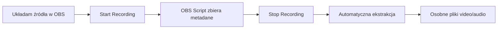

# OBS Canvas Recorder

System automatycznej ekstrakcji źródeł z nagrań canvas OBS na podstawie metadanych pozycji zapisanych podczas nagrywania.

## 🎯 Problem i Rozwiązanie

**Problem**: Nagrywanie wielu źródeł w OBS wymaga ręcznego wycinania każdego źródła po nagraniu, co jest czasochłonne i podatne na błędy.

**Rozwiązanie**: Automatyczna ekstrakcja źródeł z nagrania canvas OBS wykorzystująca:
- OBS API do detekcji capabilities źródeł (audio/video)
- Metadane pozycji zapisane podczas nagrywania
- FFmpeg do precyzyjnej ekstrakcji

## 🏗️ Architektura Systemu

### Aktualna Struktura Projektu
```
obsession/
├── src/
│   ├── core/                     # Logika biznesowa
│   │   ├── metadata.py           # Zarządzanie metadanymi + OBS API
│   │   └── extractor.py          # Ekstrakcja źródeł (FFmpeg)
│   │
│   ├── obs_integration/          # Integracja z OBS Studio
│   │   ├── obs_script.py         # Skrypt OBS (Python)
│   │   └── scene_analyzer.py     # Analiza scen OBS
│   │
│   └── cli/                      # Interface linii komend
│       └── extract.py            # CLI dla ekstrakcji
│
├── tests/                        # Testy (78 testów, 100% pass)
│   ├── test_metadata.py          # Testy metadanych + capabilities
│   ├── test_extractor.py         # Testy ekstraktora
│   ├── test_obs_script.py        # Testy integracji OBS
│   ├── test_scene_analyzer.py    # Testy analizy scen
│   ├── test_cli.py               # Testy CLI
│   └── conftest.py               # Konfiguracja testów
│
├── pyproject.toml                # Konfiguracja projektu (uv)
├── pytest.ini                   # Konfiguracja testów
└── uv.lock                       # Lock file dependencies
```

## 🚀 Workflow Systemu



### 1. Przygotowanie w OBS
- Ułóż źródła na canvas (mozaika)
- Załaduj `obs_script.py` w OBS Studio
- Konfiguruj ścieżkę zapisu metadanych

### 2. Nagrywanie
- Start Recording → skrypt przygotowuje metadane
- Stop Recording → skrypt zapisuje pełne metadane z capabilities

### 3. Ekstrakcja
```bash
# Automatycznie lub ręcznie
uv run python -m cli.extract recording.mkv metadata.json
```

## 📊 Format Metadanych (v2.0)

### Nowy format z capabilities:
```json
{
  "canvas_size": [1920, 1080],
  "fps": 30.0,
  "recording_start_time": 1751709738.0,
  "scene_name": "Scena",
  "sources": {
    "Camera1": {
      "name": "Camera1",
      "id": "v4l2_input",
      "position": {"x": 0, "y": 0},
      "scale": {"x": 1.0, "y": 1.0},
      "dimensions": {
        "source_width": 1920,
        "source_height": 1080,
        "final_width": 1920,
        "final_height": 1080
      },
      "visible": true,
      "has_audio": true,    // ← Nowe pole (OBS API)
      "has_video": true     // ← Nowe pole (OBS API)
    },
    "Microphone": {
      "name": "Microphone",
      "id": "pulse_input_capture",
      "position": {"x": 0, "y": 0},
      "has_audio": true,
      "has_video": false
    }
  },
  "recording_stop_time": 1751709739.5,
  "total_sources": 2
}
```

### Kluczowe zmiany:
- **`has_audio`/`has_video`**: Detekcja przez OBS API (`obs_source_get_output_flags`)
- **Brak pola `type`**: Zastąpione precyzyjnymi flagami
- **Specyficzna ekstrakcja**: Video → `.mp4`, Audio → `.m4a`

## 🔧 Instalacja i Setup

### Wymagania
- **Python 3.9+**
- **FFmpeg 4.4+** (w PATH)
- **OBS Studio 28+**
- **uv** (package manager)

### Instalacja
```bash
# 1. Klonuj repozytorium
git clone https://github.com/wkoziej/obsession.git
cd obsession

# 2. Zainstaluj dependencies
uv sync

# 3. Uruchom testy (sprawdź czy wszystko działa)
uv run pytest

# 4. Załaduj skrypt w OBS Studio
# OBS → Tools → Scripts → Add → src/obs_integration/obs_script.py
```

### Konfiguracja OBS Script
1. W OBS: Tools → Scripts → Add
2. Wybierz `src/obs_integration/obs_script.py`
3. Ustaw ścieżkę zapisu metadanych
4. Włącz "Enable metadata collection"

## 🎮 Użycie

### CLI Interface
```bash
# Podstawowa ekstrakcja
uv run python -m cli.extract recording.mkv metadata.json

# Z verbose output
uv run python -m cli.extract recording.mkv metadata.json --verbose

# Pomoc
uv run python -m cli.extract --help
```

### Programmatic API
```python
from src.core.extractor import extract_sources
import json

# Wczytaj metadane
with open("metadata.json", "r") as f:
    metadata = json.load(f)

# Ekstraktuj źródła
result = extract_sources("recording.mkv", metadata)

if result.success:
    print(f"Extracted {len(result.extracted_files)} files:")
    for file in result.extracted_files:
        print(f"  - {file}")
else:
    print(f"Error: {result.error_message}")
```

## 📁 Wyniki Ekstrakcji

### Struktura wyjściowa:
```
recording_20250105_143022_extracted/
├── Camera1.mp4              # Video z Camera1
├── Camera1.m4a              # Audio z Camera1  
├── Microphone.m4a           # Audio z Microphone (tylko audio)
├── ScreenCapture.mp4        # Video z ScreenCapture (tylko video)
└── ...
```

### Logika ekstrakcji:
- **`has_video=true`** → plik `.mp4` (crop filter, bez audio `-an`)
- **`has_audio=true`** → plik `.m4a` (bez video `-vn`)
- **`has_audio=false && has_video=false`** → pomijane
- **Bezpieczne nazwy plików**: znaki specjalne zastąpione `_`

## 🧪 System Testowy (TDD)

### Status testów: ✅ 78/78 (100%)

```bash
# Uruchom wszystkie testy
uv run pytest

# Testy z coverage
uv run pytest --cov=src --cov-report=html

# Tylko testy jednostkowe
uv run pytest tests/test_metadata.py tests/test_extractor.py

# Testy integracji OBS
uv run pytest tests/test_obs_script.py tests/test_scene_analyzer.py
```

### Główne kategorie testów:
- **Metadata**: Tworzenie, walidacja, capabilities detection
- **Extractor**: Ekstrakcja video/audio, crop parameters, error handling  
- **OBS Integration**: Script functionality, scene analysis
- **CLI**: Argument parsing, file handling, error reporting

## 🔄 Refaktoryzacja (Grudzień 2024)

### Co zostało zmienione:
1. **TDD → GREEN → REFACTOR**: Przejście z analizy nazw na OBS API
2. **Nowe pola**: `has_audio`/`has_video` zamiast `type`
3. **Specyficzna ekstrakcja**: Osobne pliki dla audio i video
4. **DRY + KISS**: Wspólne funkcje pomocnicze, prostsza logika
5. **Usunięcie kompatybilności wstecznej**: Zgodnie z wymaganiami

### Funkcje kluczowe:
- `determine_source_capabilities(obs_source)` - detekcja przez OBS API
- `_extract_video_source()` / `_extract_audio_source()` - specyficzna ekstrakcja
- `SourceExtractor` class - kompatybilność z testami

## 🐛 Issue Tracking

### Aktywne issue:
- **#1**: [Przetestować kamerę przez PRI (kabel/WiFi)](https://github.com/wkoziej/obsession/issues/1)

### Zgłaszanie problemów:
```bash
# Używaj gh CLI z PAGER=cat
export PAGER=cat
gh issue create --title "Problem description" --body "Detailed description"
```

## 🔮 Roadmap

### ✅ Faza 1: MVP Core (Ukończona)
- ✅ Skrypt OBS Python z detekcją capabilities
- ✅ Ekstraktor FFmpeg z TDD
- ✅ CLI interface
- ✅ 78 testów przechodzących (78% coverage)

### 🚧 Faza 2: Hardware Testing (W trakcie)
- 🔄 Test z kamerą PRI (issue #1)
- ⏳ Weryfikacja różnych typów źródeł
- ⏳ Performance testing

### 📋 Faza 3: Production Ready
- ⏳ Error recovery i logging
- ⏳ Batch processing
- ⏳ File watcher service
- ⏳ GUI interface

### 🌟 Faza 4: Advanced Features
- ⏳ Export do NLE (Kdenlive, DaVinci Resolve)
- ⏳ Web preview interface
- ⏳ AI scene detection
- ⏳ Real-time preview

## 📝 Licencja

MIT License - zobacz [LICENSE](LICENSE) dla szczegółów.

## 🤝 Kontrybuowanie

1. Fork projektu
2. Utwórz feature branch (`git checkout -b feature/AmazingFeature`)
3. Napisz testy dla nowej funkcjonalności (TDD)
4. Commit zmiany (`git commit -m 'Add AmazingFeature'`)
5. Push do branch (`git push origin feature/AmazingFeature`)
6. Otwórz Pull Request

### Standardy:
- **TDD**: Red → Green → Refactor
- **Test coverage**: 78% (cel: >90%)
- **Code style**: Ruff formatting
- **Commits**: Atomic z testami
